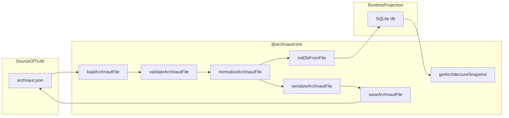

# `@archnaut/core`

**Archnaut domain model: schema, validation, normalization, and SQLite projection.**

`@archnaut/core` is the shared domain layer of the [Archnaut](https://github.com/dgosc96/Archnaut) monorepo. It owns the `archnaut.json` v1 data model and every operation that reads, validates, normalizes, persists, or projects that model into SQLite.

Downstream packages (`packages/server`, `packages/cli`, and others) import this package rather than reimplementing architecture file logic. This package does **not** include the MCP server, daemon lifecycle, HTTP transport, web UI, or file watching — it provides the primitives those layers call.

---

## Purpose in the Archnaut monorepo

Archnaut tracks a project's architecture as a version-controlled JSON artifact (`archnaut.json`) plus a local SQLite runtime store (`.archnaut/db.sqlite`). The architectural invariant enforced across the product is:

| Artifact | Role |
|---|---|
| `archnaut.json` | Git-tracked **source of truth** — canonical, normalized, human-reviewable |
| `.archnaut/db.sqlite` | **Runtime projection** — never committed, always rebuildable from JSON |

`@archnaut/core` implements that split:

1. Define and export the TypeScript types for `archnaut.json` v1.
2. Validate incoming data structurally (Zod) and semantically (cross-field rules).
3. Normalize data deterministically before every write.
4. Load and save `archnaut.json` atomically on disk.
5. Project the normalized file into a `better-sqlite3` database for fast queries.

For the full product definition (MCP tools, daemon, web UI, agent workflow), see [`PROJECT.md`](../../PROJECT.md) at the repo root.

---

## What ships in this package

The public API is a single entry point — [`src/index.ts`](src/index.ts). Exports are grouped by concern:

| Group | Key exports |
|---|---|
| **Schema types** | `ArchnautFileV1`, `Project`, `Workspace`, `Node`, `Edge`, `Concern`, `Meta`, enum types |
| **Validation** | `validateArchnautFile`, per-entity validators, `ValidationResult`, `ValidationIssue` |
| **Normalization** | `normalizeArchnautFile`, `serializeArchnautFile`, `sortById`, `dedupeSorted` |
| **Semantic IDs** | `parseNodeId`, `parseWorkspaceId`, `parseEdgeId`, `endpointSlug`, `generateNodeId`, `generateEdgeId`, `generateWorkspaceId`, `generateConcernId` |
| **Repository** | `loadArchnautFile`, `saveArchnautFile`, `createArchnautRepository`, typed errors |
| **DB projection** | `migrateDb`, `initDbFromFile`, `rebuildDbFromFile`, `getArchitectureSnapshot` |
| **Pipeline services** | `loadValidateNormalize`, `persistArchitecture` |

---

## The `archnaut.json` v1 model

`ArchnautFileV1` is defined by a strict Zod schema in [`src/validation/schemas/archnaut-file.schema.ts`](src/validation/schemas/archnaut-file.schema.ts). The top-level shape:

```typescript
interface ArchnautFileV1 {
  version: 1;                    // literal — only v1 is supported
  project: Project;              // repo metadata (id, name, root, monorepo, packageManager?)
  workspaces: Workspace[];       // monorepo workspaces / apps / packages
  nodes: Node[];                 // components, databases, queues, external services
  edges: Edge[];                 // dependency / call relationships between nodes
  concerns: Concern[];           // architectural concerns flagged for review
  meta: Meta;                    // schema version, layout positions, hook policy, etc.
}
```

### Enums

| Field | Allowed values |
|---|---|
| `workspace.kind` | `app`, `package`, `service`, `library` |
| `node.kind` | `component`, `database`, `queue`, `external` |
| `node.status` | `planned`, `implemented` |
| `node.layer` | `frontend`, `backend`, `infrastructure` (optional) |
| `edge.type` | `depends_on`, `calls`, `reads_writes`, `publishes`, `subscribes`, `owns` |
| `edge.status` | `planned`, `implemented` |
| `concern.severity` | `low`, `medium`, `high` |
| `concern.status` | `open`, `resolved` |
| `concern.source` | `agent`, `human` |
| `meta.hookPolicy` | `warn-on-daemon-down`, `block-on-daemon-down` |

### Example (trimmed)

The following is derived from the test fixture [`test/fixtures/shop-platform.ts`](test/fixtures/shop-platform.ts):

```json
{
  "version": 1,
  "project": {
    "id": "repo.shop-platform",
    "name": "Shop Platform",
    "root": ".",
    "packageManager": "pnpm",
    "monorepo": true
  },
  "workspaces": [
    { "id": "ws.web", "name": "web", "path": "apps/web", "kind": "app" },
    { "id": "ws.api", "name": "api", "path": "apps/api", "kind": "app" },
    { "id": "ws.shared", "name": "shared", "path": "packages/shared", "kind": "package" }
  ],
  "nodes": [
    {
      "id": "cmp.web.storefront",
      "name": "Storefront UI",
      "workspaceId": "ws.web",
      "kind": "component",
      "status": "implemented",
      "files": ["apps/web/src/pages/Home.tsx"]
    },
    {
      "id": "cmp.api.checkout",
      "name": "Checkout Service",
      "workspaceId": "ws.api",
      "kind": "component",
      "status": "implemented",
      "files": ["apps/api/src/modules/checkout"]
    },
    {
      "id": "ext.stripe",
      "name": "Stripe",
      "kind": "external",
      "status": "implemented",
      "files": []
    },
    {
      "id": "cmp.api.recommendations",
      "name": "Recommendations Service",
      "workspaceId": "ws.api",
      "kind": "component",
      "status": "planned",
      "files": [],
      "metadata": {
        "description": "Planned recommendation engine for product suggestions."
      }
    }
  ],
  "edges": [
    {
      "id": "edge.web.storefront-api.checkout-calls",
      "from": "cmp.web.storefront",
      "to": "cmp.api.checkout",
      "type": "calls",
      "status": "implemented"
    },
    {
      "id": "edge.api.checkout-stripe-calls",
      "from": "cmp.api.checkout",
      "to": "ext.stripe",
      "type": "calls",
      "status": "implemented"
    },
    {
      "id": "edge.catalog-recommendations",
      "from": "cmp.api.catalog",
      "to": "cmp.api.recommendations",
      "type": "calls",
      "status": "planned"
    }
  ],
  "concerns": [
    {
      "id": "concern.recommendations-source",
      "scope": "cmp.api.recommendations",
      "severity": "medium",
      "status": "open",
      "source": "human",
      "description": "Need to decide whether recommendations are batch-generated or request-time."
    }
  ],
  "meta": {
    "createdBy": "archnaut",
    "schemaVersion": "1.0.0",
    "lastNormalizedAt": "2026-06-19T00:09:00Z",
    "layout": {}
  }
}
```

---

## Data flow



**Read path:** JSON file → parse → validate → (optional) normalize → typed `ArchnautFileV1`.

**Write path:** `ArchnautFileV1` → normalize → serialize → atomic disk write → (optional) SQLite hydrate.

**Rebuild path:** load validated JSON → `migrateDb` → `initDbFromFile` → fresh projection.

---

## Core pipelines

[`src/services/architecture-pipeline.ts`](src/services/architecture-pipeline.ts) exposes two high-level entry points for downstream packages:

### `loadValidateNormalize(path)`

Loads `archnaut.json` with validation enabled, then returns a normalized copy.

```typescript
import { loadValidateNormalize } from "@archnaut/core";

const file = await loadValidateNormalize("./archnaut.json");
// nodes, edges, workspaces, concerns are sorted by id
```

Equivalent to `loadArchnautFile(path, { validate: true, normalize: false })` followed by `normalizeArchnautFile(file)`.

### `persistArchitecture(path, file, db?)`

The primary write pipeline:

1. Normalize the in-memory file.
2. Serialize and atomically save to disk.
3. If a `better-sqlite3` `Database` instance is provided, clear and repopulate it via `initDbFromFile`.

```typescript
import Database from "better-sqlite3";
import { migrateDb, persistArchitecture } from "@archnaut/core";

const db = new Database(".archnaut/db.sqlite");
migrateDb(db);

await persistArchitecture("./archnaut.json", file, db);
```

### `rebuildDbFromFile(jsonPath, dbPath)`

Standalone utility that opens (or creates) a database file, migrates schema, loads and validates JSON, and hydrates the DB. Useful for recovery or CLI `scan` operations.

```typescript
import { rebuildDbFromFile } from "@archnaut/core";

await rebuildDbFromFile("./archnaut.json", ".archnaut/db.sqlite");
```

---

## Repository layer

[`src/repository/`](src/repository/) handles filesystem I/O for `archnaut.json`.

### `loadArchnautFile(path, options?)`

| Option | Default | Description |
|---|---|---|
| `validate` | `true` | Run full validation; throw `ArchnautValidationError` on failure |
| `normalize` | `false` | Return normalized data after successful validation |

Throws:

- `ArchnautFileNotFoundError` — file does not exist (`ENOENT`)
- `ArchnautParseError` — invalid JSON
- `ArchnautValidationError` — validation failed (includes `issues` array)

### `saveArchnautFile(path, file, options?)`

| Option | Default | Description |
|---|---|---|
| `normalize` | `true` | Normalize before serializing |

Writes atomically: content is written to `<path>.tmp`, then renamed to `<path>`. On failure, throws `ArchnautWriteError`.

### `createArchnautRepository(options)`

Thin facade over load/save:

```typescript
import { createArchnautRepository } from "@archnaut/core";

const repo = createArchnautRepository({
  filePath: "./archnaut.json",
  validateOnLoad: true,   // default
  normalizeOnSave: true,  // default
});

if (await repo.exists()) {
  const file = await repo.load();
  await repo.save(file);
}
```

### Default filename

`DEFAULT_ARCHNAUT_FILENAME` is `"archnaut.json"`.

---

## Validation model

Validation is **collect-all** — every issue is gathered before returning a result. It runs in two phases.

### Phase 1: Structural (Zod)

`archnautFileSchema` and per-entity schemas (`nodeSchema`, `edgeSchema`, etc.) enforce:

- Required fields and correct types
- Strict object shapes (no unknown keys)
- Enum membership
- `version` must be literal `1`

Unsupported versions fail immediately with `INVALID_VERSION` before Zod parsing.

### Phase 2: Semantic (cross-field)

After Zod succeeds, validators walk each entity with a shared `ValidationContext` (sets of known workspace, node, and edge IDs):

| Check | Code | Severity |
|---|---|---|
| Duplicate IDs within an array | `DUPLICATE_ID` | error |
| ID collision across workspaces/nodes/edges/concerns | `DUPLICATE_ID` | error |
| `workspaceId` references unknown workspace | `MISSING_REFERENCE` | error |
| `database`/`queue`/`external` node has `workspaceId` | `CONSTRAINT_VIOLATION` | error |
| Edge `from`/`to` references unknown node | `MISSING_REFERENCE` | error |
| Edge connects node to itself | `CONSTRAINT_VIOLATION` | error |
| Duplicate `(from, to, type)` edge triple | `CONSTRAINT_VIOLATION` | error |
| ID does not match semantic prefix pattern | `INVALID_ID_FORMAT` | **warning** |
| `meta.layout` key references unknown node | `ORPHAN_LAYOUT` | **warning** |

### Errors vs warnings

```typescript
import { WARNING_CODES, validateArchnautFile } from "@archnaut/core";

const result = validateArchnautFile(data);
if (result.ok) {
  // result.value is the validated ArchnautFileV1
  // result.warnings may contain non-blocking issues
} else {
  // result.issues contains blocking errors (and any warnings)
}
```

`INVALID_ID_FORMAT` and `ORPHAN_LAYOUT` are in `WARNING_CODES`. Validation succeeds with warnings attached — legacy or hand-authored IDs that don't match canonical patterns can still load.

Per-entity validators are also exported for incremental validation during MCP tool operations:

- `validateNode`, `validateEdge`, `validateWorkspace`, `validateConcern`, `validateProject`, `validateMeta`

---

## Normalization rules

Normalization runs before every save (and inside `persistArchitecture`). It produces **deterministic, diff-friendly** JSON output.

[`normalizeArchnautFile`](src/normalize/normalize-archnaut-file.ts) applies:

| Rule | Detail |
|---|---|
| Array ordering | `workspaces`, `nodes`, `edges`, `concerns` sorted by `id` ascending |
| Path normalization | `project.root` and `workspace.path` — backslashes → forward slashes |
| Node files/tags/tech | Deduped and sorted (`dedupeSorted`) |
| Empty metadata | Stripped from nodes |
| Meta `schemaVersion` | Defaults to `"1.0.0"` if missing |
| Meta `lastNormalizedAt` | Set to current ISO timestamp |
| Meta `layout` | Keys sorted; entries for deleted/unknown nodes pruned |
| Workspace tags | Deduped and sorted; omitted if empty |

[`serializeArchnautFile`](src/normalize/serialize.ts) then:

1. Recursively sorts all object keys alphabetically.
2. `JSON.stringify(value, null, 2)` with 2-space indent.
3. Appends a trailing newline.

This guarantees stable git diffs regardless of insertion order or key ordering in memory.

---

## Semantic ID conventions

IDs are dot-separated slugs. Helpers in [`src/ids/`](src/ids/) parse and generate them.

### Patterns

| Entity | Pattern | Example |
|---|---|---|
| Workspace | `ws.<name>` | `ws.api`, `ws.web` |
| Component (app/service) | `cmp.<workspace>.<name>` | `cmp.api.checkout` |
| Component (package workspace) | `pkg.<workspace>.<name>` | `pkg.shared.types` |
| Database | `db.<name>` | `db.users` |
| External service | `ext.<name>` | `ext.stripe` |
| Queue | `queue.<name>` | `queue.events` |
| Edge | `edge.<fromTail>-<toTail>-<type>` | `edge.api.checkout-stripe-calls` |
| Concern | `concern.<slug>` | `concern.recommendations-source` |

### Generation helpers

```typescript
import {
  generateNodeId,
  generateEdgeId,
  generateWorkspaceId,
  generateConcernId,
} from "@archnaut/core";

generateWorkspaceId("api");           // "ws.api"
generateNodeId({
  kind: "component",
  workspaceId: "ws.api",
  workspaceKind: "app",
  slug: "Checkout",
});                                    // "cmp.api.checkout"
generateNodeId({ kind: "external", slug: "Stripe" }); // "ext.stripe"
generateEdgeId("cmp.api.checkout", "ext.stripe", "calls");
// "edge.api.checkout-stripe-calls"
generateConcernId("recommendations-source");
// "concern.recommendations-source"
```

**Edge ID algorithm:** derives an endpoint slug from each node ID via `endpointSlug` — for `cmp`/`pkg` nodes, `{workspace}.{name}` (e.g. `api.checkout` from `cmp.api.checkout`); for `db`/`ext`/`queue`, the name segment only (e.g. `stripe` from `ext.stripe`). Joins as `edge.<fromTail>-<toTail>-<type>`. The result is a pure function of `(fromId, toId, type)` — repeatable across runs with no insertion-order suffixes.

**Parse helper:** `parseEdgeId` returns `{ slug, type?, raw }`. Generated IDs include a trailing `-<type>` suffix; legacy hand-authored IDs without a type suffix still parse with `type` omitted.

**Slug normalization:** `normalizeSlug` lowercases, replaces spaces/underscores with hyphens, strips invalid characters.

### Parse helpers

`parseNodeId`, `parseWorkspaceId`, and `parseEdgeId` return structured objects or `null` for unparseable IDs. Used by validators for format warnings.

### Legacy IDs

Hand-authored edge IDs like `edge.web-catalog` (shorter legacy style) are valid at the structural level. They produce an `INVALID_ID_FORMAT` **warning** but do not block loading. **New edge IDs should use `generateEdgeId`.**

> **Product note:** In production, the MCP server is the mutation authority for ID assignment. The generate helpers are utilities for server implementation — agents should not invent IDs outside the server.

---

## SQLite projection

[`src/db/`](src/db/) maps the normalized `ArchnautFileV1` into relational tables for fast runtime queries.

### Schema

`migrateDb(db)` executes DDL (defined inline in [`migrate.ts`](src/db/migrate.ts); mirrored in [`schema.sql`](src/db/schema.sql)):

| Table | Contents |
|---|---|
| `project` | Single row — project metadata |
| `workspaces` | Workspace definitions; `tags_json` for tag arrays |
| `nodes` | Node core fields; `metadata_json` for metadata object |
| `node_files` | Node → file path (ordered by `ord`) |
| `node_tags` | Node → tag (many-to-many) |
| `node_tech` | Node → tech stack entry (many-to-many) |
| `edges` | Edge relationships (`from_id`, `to_id`) |
| `concerns` | Architectural concerns |
| `meta` | Key/value store for meta fields (`schemaVersion`, `layout`, etc.) |

### Hydration

`initDbFromFile(file, db)` runs inside a transaction:

1. `clearDb(db)` — delete all rows from every table.
2. Insert project, workspaces, nodes (with files/tags/tech), edges, concerns, meta rows.

Mapping logic lives in [`map.ts`](src/db/map.ts).

### Snapshot (round-trip)

`getArchitectureSnapshot(db)` reconstructs an `ArchnautFileV1` from the database. Intended primarily for **tests and dogfooding** — it is not the production read path (that goes through `archnaut.json`).

```typescript
import Database from "better-sqlite3";
import { migrateDb, initDbFromFile, getArchitectureSnapshot } from "@archnaut/core";

const db = new Database(":memory:");
migrateDb(db);
initDbFromFile(normalizedFile, db);

const roundTripped = getArchitectureSnapshot(db);
```

### Rebuild

`rebuildDbFromFile(archnautJsonPath, dbPath)` opens a database file, migrates, loads validated JSON, and hydrates — a one-shot recovery path.

---

## Public API quick reference

All exports come from the package root:

```typescript
import {
  // Types
  type ArchnautFileV1,
  type Node,
  type Edge,

  // Validation
  validateArchnautFile,

  // Normalization
  normalizeArchnautFile,
  serializeArchnautFile,

  // Repository
  loadArchnautFile,
  saveArchnautFile,
  createArchnautRepository,

  // Pipeline
  loadValidateNormalize,
  persistArchitecture,

  // DB
  migrateDb,
  initDbFromFile,
  rebuildDbFromFile,
  getArchitectureSnapshot,

  // IDs
  generateNodeId,
  generateEdgeId,
} from "@archnaut/core";
```

### Validate in-memory data

```typescript
import { validateArchnautFile } from "@archnaut/core";

const result = validateArchnautFile(unknownData);
if (!result.ok) {
  for (const issue of result.issues) {
    console.error(`${issue.path}: [${issue.code}] ${issue.message}`);
  }
}
```

### Load / save round-trip

```typescript
import { loadArchnautFile, saveArchnautFile } from "@archnaut/core";

const file = await loadArchnautFile("./archnaut.json");
file.nodes.push(newNode);
await saveArchnautFile("./archnaut.json", file); // normalizes by default
```

### Persist with in-memory SQLite

Pattern from [`test/services/pipeline.test.ts`](test/services/pipeline.test.ts):

```typescript
import Database from "better-sqlite3";
import { migrateDb, persistArchitecture, getArchitectureSnapshot } from "@archnaut/core";

const db = new Database(":memory:");
migrateDb(db);

await persistArchitecture("./archnaut.json", file, db);

const snapshot = getArchitectureSnapshot(db);
console.log(snapshot.project.name);
db.close();
```

---

## Source layout (contributors)

```
packages/core/
├── src/
│   ├── index.ts              # Public API barrel — all exports
│   ├── schema/               # Type re-exports (canonical types in validation/schemas/)
│   ├── validation/
│   │   ├── schemas/          # Zod schemas (source of truth for types)
│   │   ├── validate-*.ts     # Per-entity + full-file validators
│   │   ├── issues.ts         # ValidationResult, issue codes, warning partition
│   │   ├── validation-context.ts
│   │   └── zod-mapper.ts     # Zod error → ValidationIssue mapping
│   ├── normalize/
│   │   ├── normalize-archnaut-file.ts
│   │   ├── normalize-node.ts, normalize-edge.ts, normalize-meta.ts
│   │   ├── serialize.ts
│   │   └── sort.ts
│   ├── ids/
│   │   ├── patterns.ts       # Regex patterns, normalizeSlug, lastSegment
│   │   ├── parse-*.ts
│   │   └── generate-*.ts
│   ├── repository/
│   │   ├── load.ts, save.ts
│   │   ├── archnaut-repository.ts
│   │   ├── errors.ts
│   │   └── paths.ts
│   ├── db/
│   │   ├── migrate.ts        # DDL + clearDb
│   │   ├── map.ts            # ArchnautFileV1 ↔ SQL row mappers
│   │   ├── init-from-file.ts
│   │   ├── rebuild-from-file.ts
│   │   ├── queries.ts        # getArchitectureSnapshot
│   │   └── schema.sql        # Reference DDL (not executed directly)
│   └── services/
│       └── architecture-pipeline.ts
├── test/
│   ├── fixtures/shop-platform.ts
│   └── db/, ids/, normalize/, repository/, services/, validation/
├── package.json
├── tsconfig.json
├── vitest.config.ts
└── dist/                     # tsc output (published)
```

**Type source of truth:** Zod schemas in `validation/schemas/` infer all TypeScript types. The `schema/` directory re-exports them for ergonomic imports.

**Adding a new field:** update the Zod schema → normalization (if needed) → DB map/snapshot → validation rules → tests.

---

## Development

From the repo root or this package directory:

```bash
# Build TypeScript → dist/
pnpm --filter @archnaut/core build

# Run tests (vitest)
pnpm --filter @archnaut/core test

# Watch mode
pnpm --filter @archnaut/core test:watch
```

### Dependencies

| Package | Role |
|---|---|
| `zod` | Schema definition and structural validation |
| `better-sqlite3` | Embedded SQLite for runtime projection |

`better-sqlite3` is a native addon. The root `package.json` lists it under `pnpm.onlyBuiltDependencies`, and `.npmrc` may set `allow-build=better-sqlite3`. Node.js >= 18 is required.

### Tests

27 vitest tests cover validation, normalization, ID helpers, repository I/O, DB round-trip, and pipeline services. The `shop-platform` fixture is the canonical example architecture graph.

---

## Boundaries — what core does NOT do

| Concern | Where it belongs |
|---|---|
| HTTP server / MCP transport | `packages/server` (not yet built) |
| Daemon lifecycle (`start`/`stop`/`status`) | `packages/daemon` / `packages/cli` |
| Web UI / diagram rendering | `packages/web-ui` |
| File watching → WebSocket push | Server layer (Chokidar + `/ws`) |
| Agent task orchestration (`begin_task`, `complete_task`) | MCP server write tools |
| Rules/hooks/skills installation | `packages/rules-engine` |
| stdio MCP shim | `packages/mcp-shim` |

`@archnaut/core` is deliberately a **pure domain library** — no network, no process management, no UI. It can be imported and tested in isolation with in-memory SQLite and temp directories.

---

## Related documentation

- [`PROJECT.md`](../../PROJECT.md) — authoritative product definition and v0.1 scope
- [`CONTRIBUTING.md`](../../CONTRIBUTING.md) — coding conventions and PR workflow
- [`CURRENT.md`](../../CURRENT.md) — session handoff and implementation status
